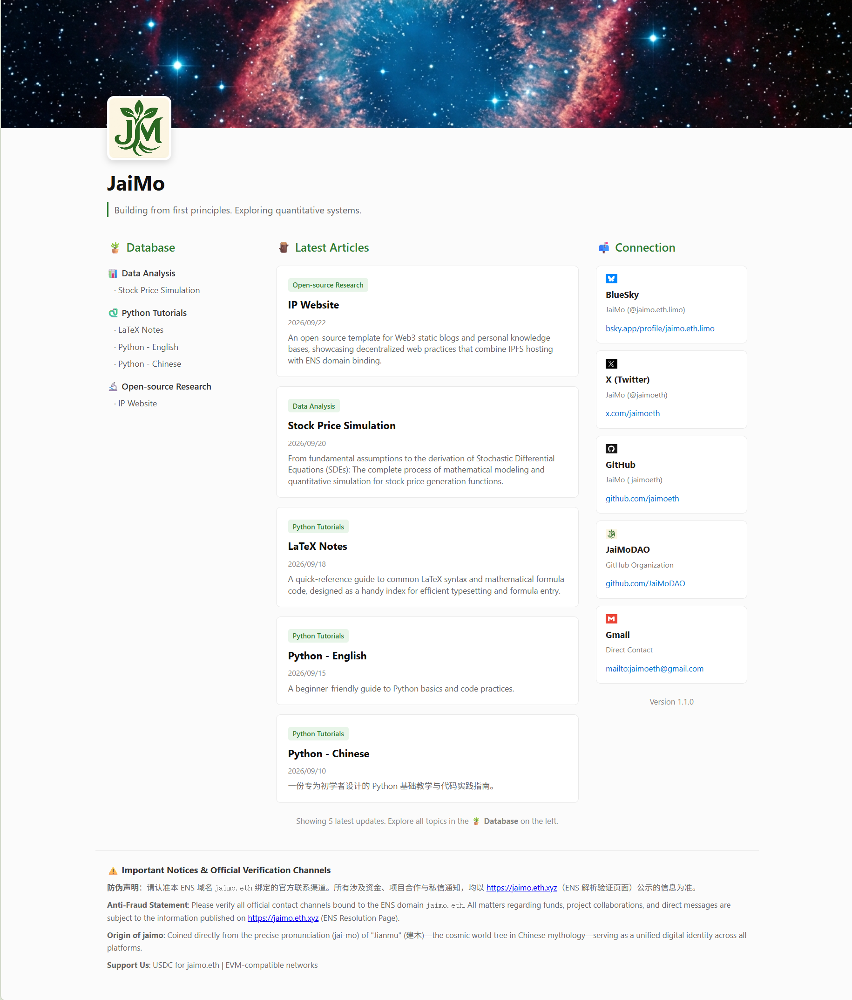

# 🌟 IP Website

**A Lightweight, Elegant & Modular Personal IP Homepage**

一个轻量、优雅且模块化的个人 IP 主页与防伪验证模板。

  <a href="#english">English</a> | <a href="#简体中文">简体中文</a> | <a href="#preview">Preview</a>

---

## English

### ✨ Features

- 🪪 **Personal IP Homepage** — Showcase your personal identity and online presence.
- 🧩 **Modular Configuration** — Manage your content through a centralized `config.js`.
- 🔗 **Custom Navigation** — Easily configure personal links and featured articles.
- 🛡️ **Anti-Counterfeiting** — Support personal identity and authenticity verification.
- 🚀 **Easy Deployment** — Deploy your website through GitHub Pages.

---

### 🚀 Quick Start

#### 1. Customize Content

Edit **`config.js`** to manage your website content.

All personal information, navigation links, featured articles, and verification notices are configured in one place.

> No need to modify the HTML source code.

#### 2. Local Preview

Clone or download this repository, then open **`index.html`** directly in your browser.

You can preview your website locally and check the effects of your configuration changes.

#### 3. Deployment

Deploy your website using **GitHub Pages**.

1. Create a repository named `yourname.github.io` under your GitHub personal account or organization.
2. Upload **all project files directly to the repository root directory**.
3. Make sure `index.html` is located in the root directory, not inside an additional wrapper folder.
4. Enable GitHub Pages in your repository settings.

> **Important:** Upload the project files directly to the repository root. Do not upload the outer project folder as an additional directory.

Once deployment is complete, your IP Website URL will be:

**`https://yourname.github.io`**

#### 4. Important Notes

* "preview.png" is the preview image;
* "LICENSE" contains the open-source license details;
* "README.md" contains the project documentation;
* All three can be deleted without affecting the project's deployment or actual usage.

---

## 简体中文

### ✨ 功能特点

- 🪪 **个人 IP 主页** — 展示个人身份与线上信息。
- 🧩 **模块化配置** — 通过统一的 `config.js` 管理网站内容。
- 🔗 **自定义导航** — 灵活配置个人链接与精选文章。
- 🛡️ **防伪验证** — 支持个人身份与真实性验证。
- 🚀 **便捷部署** — 支持通过 GitHub Pages 快速上线。

### 🚀 快速上手

#### 1. 调整内容

编辑 **`config.js`**，即可管理网站的所有主要内容。

个人资料、导航链接、精选文章以及防伪声明，均集中在配置文件中进行管理。

> 无需修改任何 HTML 源码。

#### 2. 本地预览

将项目下载或克隆到本地后，直接双击 `index.html`，或将其拖入浏览器中打开。

即可进行本地预览，并查看配置修改后的网页效果。

#### 3. 部署上线

使用 **GitHub Pages** 部署你的个人 IP Website。

1. 在 GitHub 个人账号或组织账号下创建一个名为 `yourname.github.io` 的仓库。
2. 将**所有项目文件直接上传到仓库根目录**。
3. 确保 `index.html` 位于仓库根目录，而不是额外的外层文件夹中。
4. 在仓库设置中启用 GitHub Pages。

> **重要提示：** 请将项目文件直接上传到仓库根目录，切勿将整个外层项目文件夹作为额外目录上传。

部署完成后，你的 IP Website 网址即为：

**`https://yourname.github.io`**

#### 4. 注意事项

* "preview.png"是预览效果图；
* "LICENSE"是开源许可说明；
* "README.md"是项目说明内容；
* 此三者均可删除，不影响项目部署实际使用效果。

---

## Preview

---

**Built with simplicity, modularity, and personal identity in mind.**

